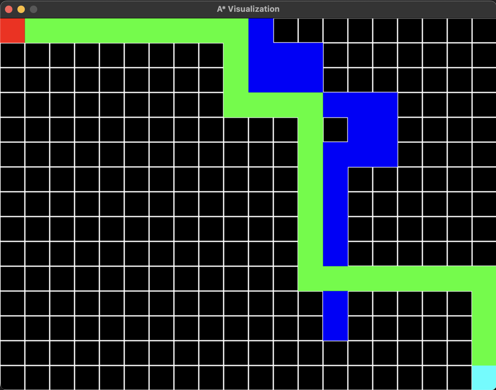

# A* Pathfinding Visualization with SDL

This C++ program visualizes the A* pathfinding algorithm using the Simple DirectMedia Layer (SDL) library. It allows users to interactively set the start and end points on a grid, as well as place obstacles to find a path between them using the A* algorithm.



## Prerequisites

To run this program, you need to have the following prerequisites installed:

- C++ compiler (e.g., g++)
- Simple DirectMedia Layer (SDL) library (libsdl2-dev)

You can install the SDL library on Debian-based systems using the following command:

    ```bash
    sudo apt-get install libsdl2-dev

**Usage**

Click on the grid to place the start point. A prompt will instruct you to do so.
After placing the start point, click on the grid to place the end point.
Once the start and end points are set, you can place obstacles on the grid by clicking on the desired cells.
Press the Enter key when you're done placing obstacles to trigger the A* pathfinding algorithm.
The program will visualize the path (if found) in green, and the start and end points in red and cyan, respectively.

**Features**
Interactive Visualization: The program provides an interactive grid-based visualization of the A* pathfinding algorithm, making it easy to understand the pathfinding process.
Dynamic Point Placement: You can dynamically place the start and end points on the grid, allowing you to explore different scenarios.
Obstacle Simulation: You can place obstacles on the grid to simulate real-world scenarios and observe how the A* algorithm navigates around them.
Real-Time Pathfinding: The program provides real-time pathfinding visualization, helping you see how the algorithm explores different paths.
A Pathfinding Algorithm*: It utilizes the A* pathfinding algorithm, known for its efficiency in finding optimal routes.

**Explanation**

    A* Pathfinding Algorithm
    The A* (A-star) algorithm is a popular pathfinding algorithm used in computer science and game development to find the shortest path between two points on a grid while considering obstacles. It intelligently explores possible paths and selects the most promising ones based on a combination of two factors:

    - G-Cost: The cost of reaching a particular point from the starting point. It represents the distance traveled.

    - H-Cost (Heuristic Cost): An estimate of the cost from a point to the target. It measures the "as-the-crow-flies" distance.

    By combining the G-Cost and H-Cost, the algorithm selects the path with the lowest total cost, ensuring an efficient and optimal route.


**Customization**

    You can customize the grid size and other settings by modifying the code in the `main.cpp` file. Additionally, you can adjust the appearance of the grid, obstacles, and path by modifying the rendering code in the same file.

