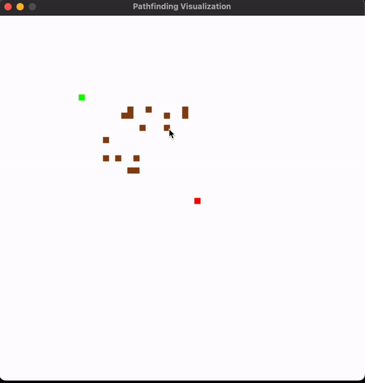
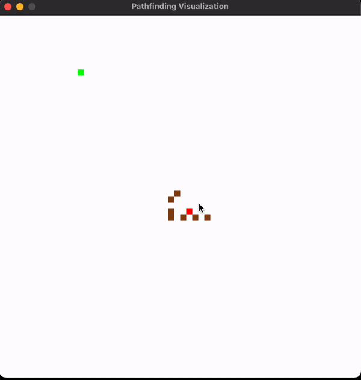
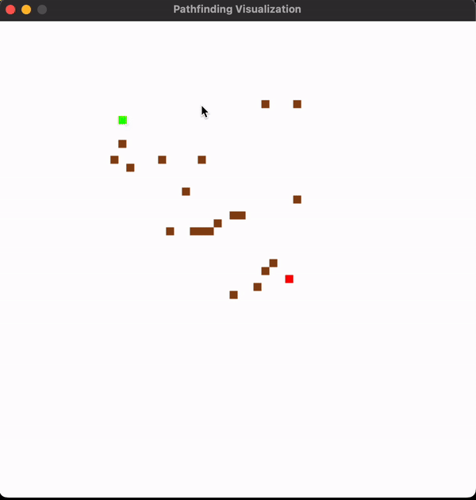

# Algorithm Visualizer

Your go-to repository for exploring and mastering a variety of algorithms, including A*, DFS, BFS, and Dijkstra's.

This project is built using C++ and SDL libraries to create interactive visualizations of these algorithms in action.

## Algorithms Visualized:

### 1. A* Algorithm
A* (A-star) is a popular pathfinding and graph traversal algorithm that is widely used in applications such as games and robotics.

### 2. Depth-First Search (DFS)
DFS is a graph traversal algorithm that explores as far as possible along each branch before backtracking.

### 3. Breadth-First Search (BFS)
BFS is a graph traversal algorithm that explores all nodes at the present depth level before moving on to nodes at the next depth level.

## Project Details
This project leverages C++ along with the SDL (Simple DirectMedia Layer) library for rendering and visualizing these algorithms. SDL provides the necessary tools to handle graphics, input, and events, making it ideal for creating visually interactive algorithm simulations.

---

Feel free to explore the code, test out the algorithms, and gain deeper insights into how these fundamental algorithms work!
